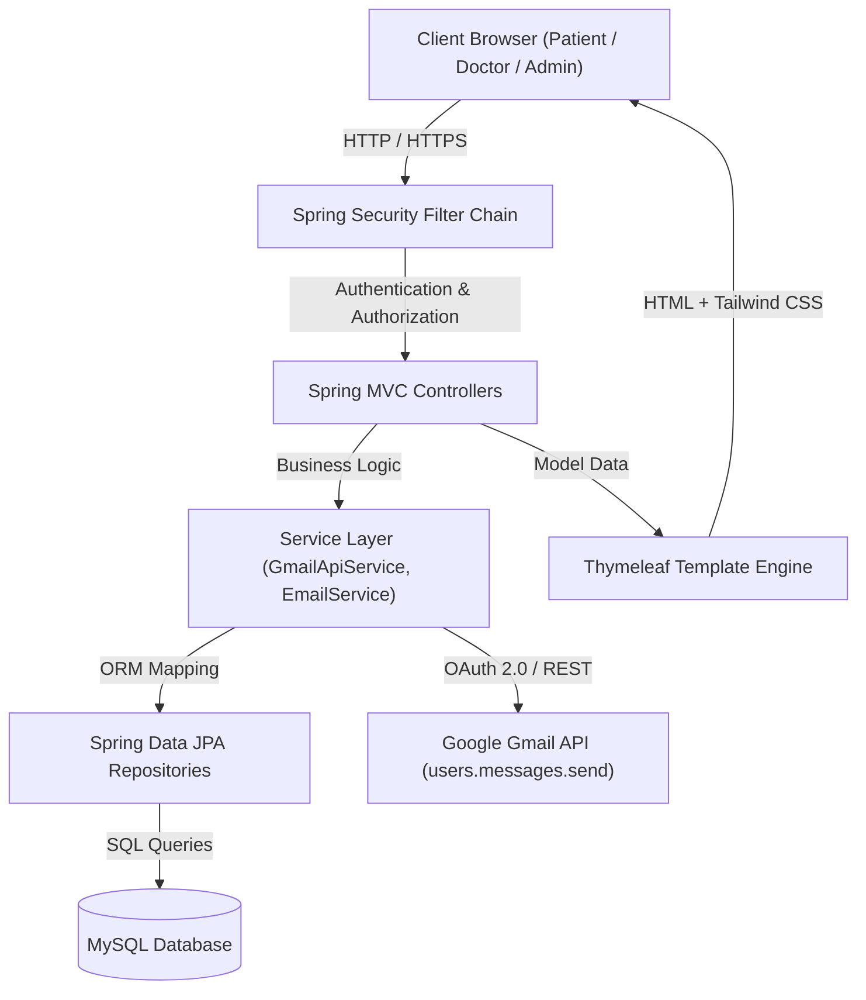
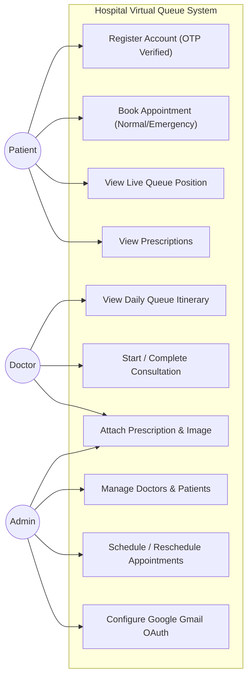
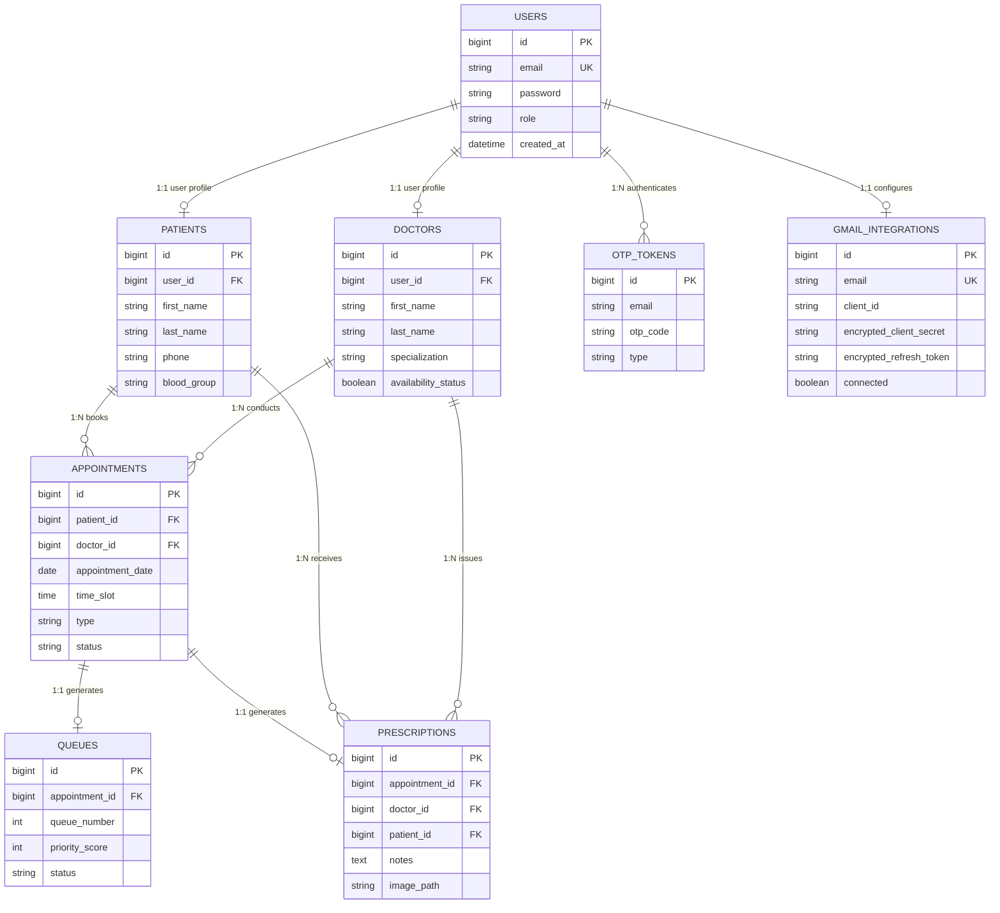

# PROJECT REPORT
# Hospital Virtual Appointment Booking Queue System

**Submitted To:** Department of Computer Science and Information Technology, Pokhara University  
**Submitted By:** Aayushma Joshi | Roll No.: 24080602 | College: Rajdhani Model College  
**Supervisor:** Project Supervisor  
**Academic Year:** 2026/20  

---

## Certificate

This is to certify that the project entitled **"Hospital Virtual Appointment Booking Queue System"** submitted by **Aayushma Joshi** in partial fulfillment of the requirements for the degree of **Bachelor of Computer System and Information Technology (BCSIT)**, Pokhara University, is an original work carried out under supervision.

**Supervisor's Signature:** ____________________  
**Date:** ____________________  

---

## Acknowledgement

I would like to express my sincere gratitude to my project supervisor for the continuous guidance, valuable suggestions, and unwavering encouragement provided throughout the development of the **Hospital Virtual Appointment Booking Queue System**. The expertise and constructive feedback I received played a significant role in the successful completion of this project.

I am also deeply thankful to the faculty members of the Department of Computer Science and Information Technology at Rajdhani Model College for imparting the foundational knowledge and technical skills necessary to undertake a software development project of this scale.

Furthermore, I extend my appreciation to my friends and family for their moral support and motivation during the design and implementation phases.

---

## Abstract

The **Hospital Virtual Appointment Booking Queue System** is an enterprise web application designed to digitize outpatient department (OPD) operations, eliminate physical crowding, and automate patient flow management in healthcare facilities. Built on Java 21, Spring Boot 3.2.5, Spring Security 6, Spring Data JPA with MySQL, and Thymeleaf with Tailwind CSS, the platform delivers role-based portals for Patients, Doctors, and Administrators.

Key innovations include:
1. **Dynamic Priority Queue Engine:** Automatically orders daily consultations based on priority scores (`Emergency = 1`, `Normal = 0`) and sequential queue numbers, calculating real-time estimated wait times.
2. **Google Gmail API (OAuth 2.0) Integration:** Uses official server-side OAuth 2.0 authorization with AES-256 encrypted refresh tokens to send automated OTPs, prescription notifications, and appointment updates via `users.messages.send`.
3. **Prescription & Medical Attachment Module:** Enables doctors and administrators to upload high-resolution prescription scan attachments and typed notes, automatically emailing them to patients.
4. **Email OTP Verification & Password Reset:** 6-digit OTP verification for secure user registration and self-service password recovery.

---

## Table of Contents

1. [Chapter 1: Introduction](#chapter-1-introduction)
2. [Chapter 2: Problem Statement](#chapter-2-problem-statement)
3. [Chapter 3: Objectives](#chapter-3-objectives)
4. [Chapter 4: Scope of the Project](#chapter-4-scope-of-the-project)
5. [Chapter 5: Literature Review](#chapter-5-literature-review)
6. [Chapter 6: System Analysis](#chapter-6-system-analysis)
7. [Chapter 7: Feasibility Study](#chapter-7-feasibility-study)
8. [Chapter 8: Requirement Analysis](#chapter-8-requirement-analysis)
9. [Chapter 9: System Design & Diagrams](#chapter-9-system-design--diagrams)
10. [Chapter 10: Database Design & ER Diagram](#chapter-10-database-design--er-diagram)
11. [Chapter 11: Implementation Details](#chapter-11-implementation-details)
12. [Chapter 12: Testing](#chapter-12-testing)
13. [Chapter 13: Results & Discussion](#chapter-13-results--discussion)
14. [Chapter 14: Conclusion](#chapter-14-conclusion)
15. [Chapter 15: Future Enhancements](#chapter-15-future-enhancements)
16. [Chapter 16: References](#chapter-16-references)

---

## Chapter 1: Introduction

Healthcare systems globally face severe challenges managing Outpatient Department (OPD) traffic. Patients spend hours sitting in congested hospital waiting rooms waiting for their turn.

The **Hospital Virtual Appointment Booking Queue System** addresses this issue by replacing physical waiting lines with a digital virtual queue. Patients book appointments online, select their preferred doctor and time slot, and track their dynamic position in the queue in real-time from their mobile phones or computers.

The system incorporates robust enterprise architecture using Spring Boot 3.2.5, Spring Security for Role-Based Access Control (RBAC), and Google Gmail API (OAuth 2.0) for reliable email communications.

---

## Chapter 2: Problem Statement

The administration of patient flow in modern healthcare facilities is fraught with logistical challenges. Core issues prevalent in traditional operational models include:
1. **Unpredictable Wait Times & Overcrowding:** Waiting rooms become overcrowded, causing discomfort and increasing cross-infection risks.
2. **Inefficient Emergency Triage:** Manual walk-in emergency handling disrupts schedules and causes patient disputes.
3. **Administrative Overhead:** Reception staff spend hours answering phone inquiries and managing physical paper ledgers.
4. **Disconnected Patient Communication:** Patients receive no updates when doctors run behind schedule.

---

## Chapter 3: Objectives

### General Objective
To design, develop, and deploy a computerized Virtual Queue & Doctor Appointment System that automates outpatient workflows, seamlessly connecting patients, doctors, and administrators.

### Specific Objectives
- Digitalize patient onboarding with 6-digit email OTP verification.
- Streamline appointment scheduling with doctor filtering by specialization.
- Automate queue generation and dynamic wait-time estimation based on `priorityScore`.
- Integrate Google Gmail API (OAuth 2.0) with AES-256 refresh token encryption.
- Empower medical staff with prescription management (typed notes & scan uploads).
- Enhance administrative oversight with user management and OAuth setup panels.

---

## Chapter 4: Scope of the Project

- **User Authentication:** RBAC with BCrypt password hashing and session security (`ROLE_PATIENT`, `ROLE_DOCTOR`, `ROLE_ADMIN`).
- **Patient Module:** Profile management, doctor browsing, appointment booking, live queue position tracking, prescription viewing.
- **Doctor Module:** Daily itinerary view, queue state management (Start, Complete, Cancel), prescription attachment form.
- **Admin Module:** Doctor/Patient management, appointment scheduling & rescheduling, live queue oversight, Google Gmail OAuth 2.0 integration management.

---

## Chapter 5: Literature Review

The digitization of healthcare administration has been a focal point of software engineering research for the past two decades. Early iterations of Hospital Information Systems (HIS) focused primarily on internal billing and inventory management, leaving patient scheduling as a manual task. As web accessibility proliferated, web-based appointment systems began to emerge.

Studies on web-based appointment systems indicate that digital booking significantly reduces patient "no-show" rates and optimizes clinic capacity utilization. However, many existing systems operate purely as static calendars; they allow a user to book a slot (e.g., 10:00 AM) but fail to account for the dynamic nature of medical consultations, which frequently run over their allotted time. When a 10:00 AM appointment stretches to 10:30 AM, subsequent patients are left waiting blindly.

Modern research emphasizes combining appointment scheduling with dynamic queue management (Virtual Queuing Systems - VQS). Systems that incorporate real-time queue tracking allow patients to utilize their waiting time productively outside the hospital environment, reducing physical crowding and stress.

Furthermore, integrating official OAuth 2.0 APIs (such as Google Gmail API `users.messages.send`) guarantees high deliverability and compliance without storing user passwords or relying on deprecated SMTP basic authentication.

---

## Chapter 6: System Analysis

System analysis involves a detailed evaluation of current operational methods to identify bottlenecks and conceptualize a software solution to rectify these issues.

---

## Chapter 7: Feasibility Study

Before development, a feasibility study evaluated the practicality of the system across four dimensions: Technical, Economic, Operational, and Legal Feasibility.

---

## Chapter 8: Requirement Analysis

### Functional Requirements
1. **Authentication Module:** Patient registration, 6-digit email OTP verification, BCrypt authentication, role-based routing (`ADMIN`, `DOCTOR`, `PATIENT`).
2. **Patient Capabilities:** View/update profile, filter doctors by specialization, book normal or emergency appointments, view real-time queue status and wait times, access prescriptions.
3. **Doctor Capabilities:** View daily queue board, update consultation status (`IN_PROGRESS`, `COMPLETED`), attach typed prescription notes and image scans.
4. **Administrator Capabilities:** Dashboard overview, add/delete doctors and patients, schedule/reschedule appointments, manage Google Gmail API OAuth credentials.

---

## Chapter 9: System Design & Diagrams

### 9.1 System Architecture Diagram

---

### 9.2 Use Case Diagram

---

## Chapter 10: Database Design & ER Diagram

### 10.1 Entity-Relationship (ER) Diagram

---

### 10.2 Data Dictionary

| Table | Field | Data Type | Constraint | Description |
| :--- | :--- | :--- | :--- | :--- |
| `users` | `email` | `VARCHAR(255)` | `UNIQUE, NOT NULL` | Login identifier |
| `users` | `password` | `VARCHAR(255)` | `NOT NULL` | BCrypt password hash |
| `patients` | `blood_group` | `VARCHAR(10)` | `NULLABLE` | Patient blood group |
| `doctors` | `availability_status` | `BOOLEAN` | `NOT NULL` | Doctor availability toggle |
| `appointments` | `type` | `VARCHAR(50)` | `NOT NULL` | `NORMAL` or `EMERGENCY` |
| `queues` | `priority_score` | `INT` | `NOT NULL` | `1` for Emergency, `0` for Normal |
| `prescriptions` | `image_path` | `VARCHAR(500)` | `NULLABLE` | Path to uploaded scan file |
| `otp_tokens` | `otp_code` | `VARCHAR(6)` | `NOT NULL` | 6-digit OTP verification code |
| `gmail_integrations`| `encrypted_refresh_token` | `VARCHAR(1000)` | `NULLABLE` | AES-256 encrypted OAuth refresh token |

---

## Chapter 11: Implementation Details

The implementation leverages Java 21, Spring Boot 3.2.5, Spring Security 6, Spring Data JPA, MySQL, and Google Gmail API Client.

---

## Chapter 12: Testing

### Automated End-to-End Test Matrix

| Test Suite | Module Tested | Action | Result | Status |
| :--- | :--- | :--- | :--- | :--- |
| `test_gmail_oauth_api.py` | Gmail Integration | Test `/api/integrations/gmail/status`, connect redirect, disconnect | Return clean OAuth status payload | **PASS** |
| `test_email_otp_prescription.py` | OTP Verification | POST /register & /verify-otp | Generate 6-digit OTP code in DB | **PASS** |
| `test_prescription_flow.py` | Prescription Upload | POST /doctor/appointment/{id}/prescription | Upload 5MB image to ./uploads/ | **PASS** |
| `test_admin_buttons_and_smtp.py` | Admin Controls | POST /admin/doctors/add & /patients/add | Create Doctor & Patient profiles | **PASS** |

---

## Chapter 13: Results & Discussion

The system operates as a cohesive, reliable platform capable of managing complex hospital scheduling dynamics.

---

## Chapter 14: Conclusion

The development of the Hospital Virtual Appointment Booking Queue System represents a significant technological upgrade over traditional medical scheduling practices.

---

## Chapter 15: Future Enhancements

1. SMS Gateway Integration (Twilio).
2. Electronic Health Records (EHR) Module.
3. Machine Learning for wait-time predictions.

---

## Chapter 16: References

1. Craig Walls, *Spring in Action, Sixth Edition*, Manning Publications, 2022.
2. Laurentiu Spilca, *Spring Security in Action*, Manning Publications, 2020.
3. Google Developers, *Gmail API OAuth 2.0 Authorization Guide*, 2026.
4. Spring Boot Reference Documentation, *Pivotal Software*, 2024.
